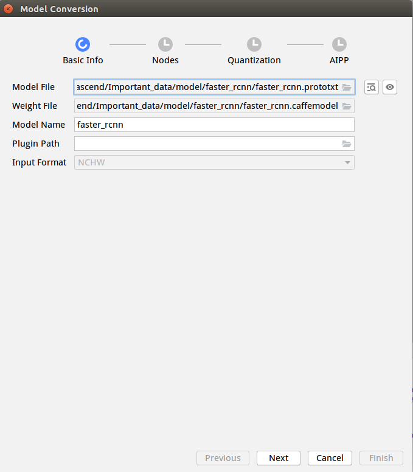
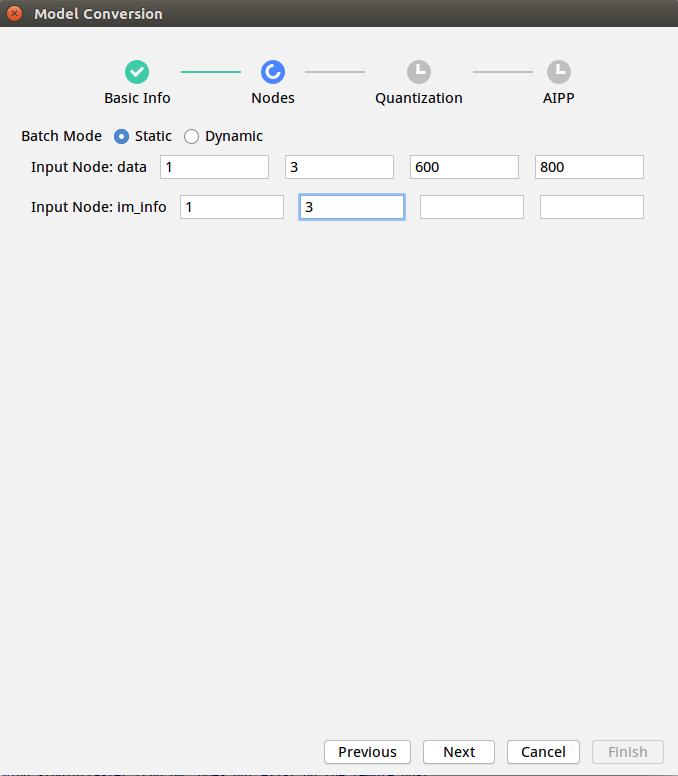
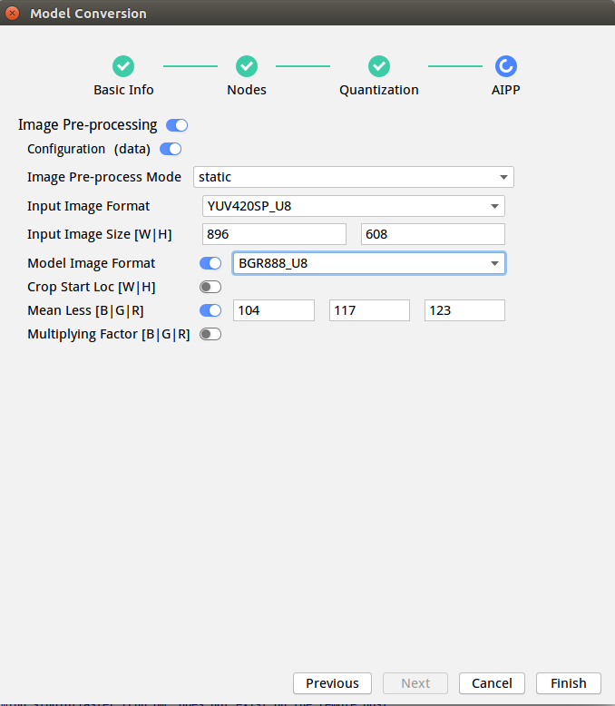

EN|[CN](Readme.md)

# Object Detection<a name="ZH-CN_TOPIC_0208837806"></a>

The object detection application runs on the Atlas 200 DK or the AI acceleration cloud server and implements the inference function by using Faster R-CNN object detection network.


## Prerequisites<a name="zh-cn_topic_0203223280_section137245294533"></a>

Before using an open source application, ensure that:

-   **Mind Studio**  has been installed.
-   The Atlas 200 DK developer board has been connected to  **Mind Studio**, the cross compiler has been installed, the SD card has been prepared, and basic information has been configured.

## Software Preparation<a name="zh-cn_topic_0203223280_section181111827718"></a>

Before running the application, obtain the source code package and configure the environment as follows.

1.   <a name="zh-cn_topic_0203223280_li953280133816"></a>Obtain the source code package.


     Download all the code in the sample-objectdetection repository at  [https://github.com/Atlas200DKTest/sample-objectdetection/tree/1.3x.0.0/](https://github.com/Atlas200DKTest/sample-objectdetection/tree/1.3x.0.0/) to any directory on Ubuntu Server where  **Mind Studio**  is located as the  **Mind Studio**  installation user, for example, these two files must be saved in the same directory, for example, **$HOME/AscendProjects/sample-objectdetection**.

2.  <a name="zh-cn_topic_0203223280_li2074865610364"></a>Obtain the source network model required by the application.

    Obtain the source network model and its weight file used in the application by referring to  [Table 1](#zh-cn_topic_0203223280_table19942111763710)and save them to any directory on the Ubuntu server where  Mind Studio  is located (for example,  **$HOME/models/faster\_rcnn**).
    
    **Table  1**  Models used in the detection network application

    <a name="zh-cn_topic_0203223280_table19942111763710"></a>
    <table><thead align="left"><tr id="zh-cn_topic_0203223280_row611318123710"><th class="cellrowborder" valign="top" width="11.959999999999999%" id="mcps1.2.4.1.1"><p id="zh-cn_topic_0203223280_p81141820376"><a name="zh-cn_topic_0203223280_p81141820376"></a><a name="zh-cn_topic_0203223280_p81141820376"></a>Model Name</p>
    </th>
    <th class="cellrowborder" valign="top" width="8.07%" id="mcps1.2.4.1.2"><p id="zh-cn_topic_0203223280_p13181823711"><a name="zh-cn_topic_0203223280_p13181823711"></a><a name="zh-cn_topic_0203223280_p13181823711"></a>Model Description</p>
    </th>
    <th class="cellrowborder" valign="top" width="79.97%" id="mcps1.2.4.1.3"><p id="zh-cn_topic_0203223280_p1717182378"><a name="zh-cn_topic_0203223280_p1717182378"></a><a name="zh-cn_topic_0203223280_p1717182378"></a>Model Download Path</p>
    </th>
    </tr>
    </thead>
    <tbody><tr id="zh-cn_topic_0203223280_row1119187377"><td class="cellrowborder" valign="top" width="11.959999999999999%" headers="mcps1.2.4.1.1 "><p id="zh-cn_topic_0203223280_p7118189378"><a name="zh-cn_topic_0203223280_p7118189378"></a><a name="zh-cn_topic_0203223280_p7118189378"></a>faster_rcnn</p>
    </td>
    <td class="cellrowborder" valign="top" width="8.07%" headers="mcps1.2.4.1.2 "><p id="zh-cn_topic_0203223280_p151818183718"><a name="zh-cn_topic_0203223280_p151818183718"></a><a name="zh-cn_topic_0203223280_p151818183718"></a>Network model for object detection.</p>
    <p id="zh-cn_topic_0203223280_p11121816373"><a name="zh-cn_topic_0203223280_p11121816373"></a><a name="zh-cn_topic_0203223280_p11121816373"></a>It is a Faster R-CNN model based on Caffe.</p>
    </td>
    <td class="cellrowborder" valign="top" width="79.97%" headers="mcps1.2.4.1.3 "><p id="zh-cn_topic_0203223280_p611318163718"><a name="zh-cn_topic_0203223280_p611318163718"></a><a name="zh-cn_topic_0203223280_p611318163718"></a>Download the source network model file and its weight file by referring to<strong id="en-us_topic_0182554604_b17606155113121"><a name="en-us_topic_0182554604_b17606155113121"></a><a name="en-us_topic_0182554604_b17606155113121"></a> README.md</strong> in <a href="https://github.com/HuaweiAscendTest/models/tree/master/computer_vision/object_detect/faster_rcnn" target="_blank" rel="noopener noreferrer">https://github.com/HuaweiAscendTest/models/tree/master/computer_vision/object_detect/faster_rcnn</a>.</p>
    </td>
    </tr>
    </tbody>
    </table>

3.  Log in to Ubuntu Server where **Mind Studio** is located as the **Mind Studio** installation user, confirm current DDK version and set the  environment variable  **DDK\_HOME**, **tools\_version**, **NPU\_DEVICE\_LIB** and **LD\_LIBRARY\_PATH**.

    1.  <a name="zh-cn_topic_0203223280_zh-cn_topic_0203223294_li61417158198"></a>Find current DDK version number.

        Current DDK version number can be obtained by either Mind studio tool or DDK packages.

        -    Using **Mind studio** tool.

             choose **File \> Settings \> System Settings \> Ascend DDK** from the main menu of Mind Studio, DDK version inquiry page will display as [Figure 1](zh-cn_topic_0203223294.md#fig94023140222).

             **Figure 1** DDK version inquiry page<a name="zh-cn_topic_0203223280_zh-cn_topic_0203223294_fig17553193319118"></a>  
             

             **DDK Version** shows in this page is current DDK version, for example, **1.31.T15.B150**.

        -   Using DDK package
             
             Obtain DDK version by installed DDK package name.
             
             The format of DDK package name is: **Ascend\_DDK-\{software version\}-\{interface version\}-x86\_64.ubuntu16.04.tar.gz**
             
             Where **software version** represents the DDK version.
             
             For example:
             
             If the name of DDK package is **Ascend\_DDK-1.31.T15.B150-1.1.1-x86\_64.ubuntu16.04.tar.gz**, the DDK version would be **1.31.T15.B150**.

    2.  Set the environment variable.

        **vim \~/.bashrc**

        Run the following commands to add the environment variables  **DDK\_HOME**  and  **LD\_LIBRARY\_PATH**  to the last line:

        **export tools\_version=_1.31.X.X_**

        **export DDK\_HOME=\\$HOME/.mindstudio/huawei/ddk/\\$tools\_version/ddk**

        **export NPU\_DEVICE\_LIB=$DDK\_HOME/../RC/host-aarch64\_Ubuntu16.04.3/lib**

        **export LD\_LIBRARY\_PATH=$DDK\_HOME/lib/x86\_64-linux-gcc5.4**

        > **NOTE：**   
        >-    **_1.31.X.X_** is the DDK version obtained from [Figure 1](#zh-cn_topic_0203223280_zh-cn_topic_0203223294_li61417158198), it needs be filled according to the inquiry result，for example, **1.31.T15.B150**  
        >-   If the environment variables have been added, this step can be skipped.

        Enter  **:wq!**  to save and exit.

        Run the following command for the environment variable to take effect:
         
        **source \~/.bashrc**

4.  Convert the source network to a model supported by Ascend AI processor.

    1.  Choose  **Tool \> Convert Model**  from the main menu of  Mind Studio. The  **Convert Model**  page is displayed.
    2.  On the  **Convert Model**  page, perform model conversion configuration.
        -   set  **Model File** to the model file downloaded in  [Step 2](#zh-cn_topic_0203223280_li2074865610364), the weight file would be automatically matched and filled in **Weight File**.
        -  Set **Model Name** to model name in [Table 1](#zh-cn_topic_0203223280_table19942111763710)：**faster\_rcnn**.

            

        -   There are two **Input Node** in the Nodes configuration, 1, 3 need to be entered in the first two cells of the node in the second row.

            

        -   **Input Image Size** in AIPP configuration needs to be set to 896、608 respectively, 128 \*16 alignment is required here,  for **Model Image Format**, select BGR888\_U8, and retain default values for other parameters.

            

    3.  Click  **Finish**  to start model conversion.

        After successful conversion, a .om offline model file is generated in : **$HOME/modelzoo/faster\_rcnn/device**.

5.  upload the converted model file(.om file) to “**sample\_objectdetection/script**” directory  in the source code path in [Step 1](#zh-cn_topic_0203223280_li953280133816).

## Compile<a name="zh-cn_topic_0203223280_section3723145213347"></a>

1.  Open the corresponding project.


    Enter the “**MindStudio-ubuntu/bin**” directory after decompressing the installation package in the command line as the **Mind Studio** installation user, for example, **$HOME/MindStudio-ubuntu/bin**. Run the following command to start **Mind Studio**:

    **./MindStudio.sh**

    After successfully starting **Mind Studio**, open **sample\_objectdetection**project，as shown in [Figure 2](#zh-cn_topic_0203223280_fig05481157171918).

    **Figure 2**  Open objectdetection project<a name="zh-cn_topic_0203223280_fig05481157171918"></a>  
    

    

2.  Configure related project information in **src/param\_configure.conf**.

    **Figure 3**   Configuration file path<<a name="zh-cn_topic_0203223280_fig0391184062214"></a>  
    

    The configuration file is as follows:

    ```
    remote_host=
    ```

    Following parameter configuration needs to be added manually：

    remote\_host：this parameter indicates the IP address of Atlas 200 DK developer board.
    
    An example of configuration is as follows:

    ```
    remote_host=192.168.1.2
    ```

    > **NOTE：**   
    >-   Note that the "" symbol is no need to be used when filling in parameters.
    
3.  Begin to compile, open **Mind Studio** tool, click **Build \> Build \> Build-Configuration** in the toolbar, shown as [Figure 4](zh-cn_topic_0203223280.md#fig1625447397), **build** and **run** folders will be generated under the directory.

    **Figure 4**  Compilation operation and generated files<a name="zh-cn_topic_0203223280_fig21857144016"></a>  
    

    

    > **NOTE：**   
    >When you compile the project for the first time, **Build \> Build** is gray and not clickable. Your need to click **Build \> Edit Build Configuration**, configure the compilation parameters and then compile.  
    >  

4.  Upload the images to be inferred to the directory of the  **HwHiAiUser**  user on the host.


    The image requirements are as follows:

    -   Format: JPG, PNG, and BMP.
    -   Width of the input image: the value is an integer ranging from 16px to 4096px.
    -   Height of the input image: the value is an integer ranging from 16px to 4096px.


## Running<a name="zh-cn_topic_0203223280_section1620073406"></a>

1. Find the **Run** button in the toolbar in **Mind Studio** tool, click  **Run \> Run 'sample-objectdetection'**, as shown in[Figure 5](zh-cn_topic_0203223280.md#fig93931954162719), the executable program has been executed on the developer board.

    **Figure 5**  Executed program<a name="zh-cn_topic_0203223280_fig8208744013"></a>  
    

    

     Please ignore the above error, because **Mind Studio** cannot pass parameters for executable programs.  The above steps are to deploy the executable program and the dependent library files to the developer board. This step requires log in to developer board to the corresponding directory file in SSH mode and execute manually. For details, refer to the following steps.

2.  Log in to the Host as the  **HwHiAiUser**  user in SSH mode on Ubuntu Server where  Mind Studio  is located.

    **ssh HwHiAiUser@**_host\_ip_

     For the Atlas 200 DK, the default value of  _**host\_ip**_  is  **192.168.1.2**  \(USB connection mode\) or  **192.168.0.2**  \(NIC connection mode\).

3.  Go to the path of the executable file of object detection application.

    Example command:


    **cd \~/HIAI\_PROJECTS/workspace\_mind\_studio/sample\_objectdetection\_28ac8121/out**

4.  Run the application.

    Run the  **run\_object\_detection\_faster\_rcnn.py**  script to print the inference result on the execution terminal.

    Example command:

    **python3 run\_object\_detection\_faster\_rcnn.py -w  _800_  -h  _600_  -i**

    **_./example.jpg_  -o  _./out_  -c  _21_**

    -   **-w/model\_width**: width of the input image of a model. The value is an integer ranging from 16 to 4096.
    -   **-h/model\_height**: height of the input image of a model. The value is an integer ranging from 16 to 4096.
    -   **-i/input\_path**: directory or path of the input image. You can enter multiple paths.
    -   **-o/output\_path**: directory for storing output images. The default setting is the current directory.
    -   **-c/output\_categories**: number of Faster R-CNN detection categories \(including the background\). The value is an integer ranging from 2 to 32. The default value is  **21**.
    
5.  For other parameters, run the   **python3 run\_object\_detection\_faster\_rcnn.py --help**  command. For details, see the help information.
